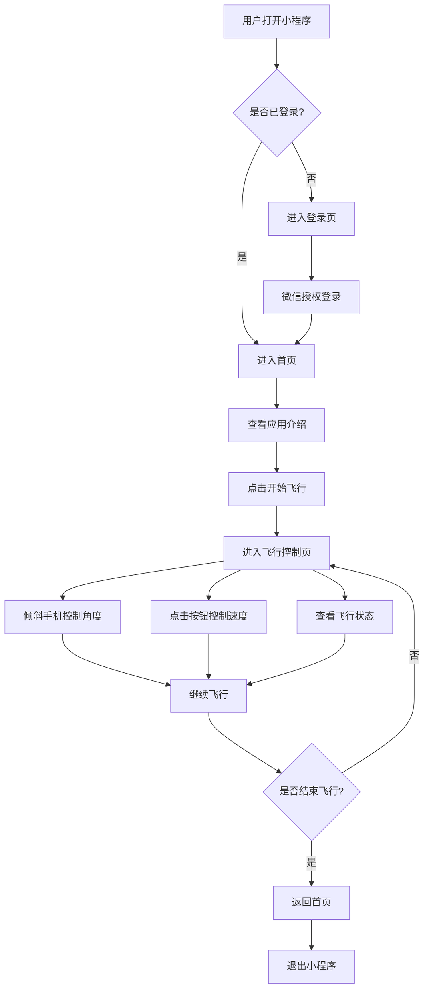
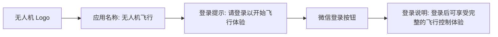
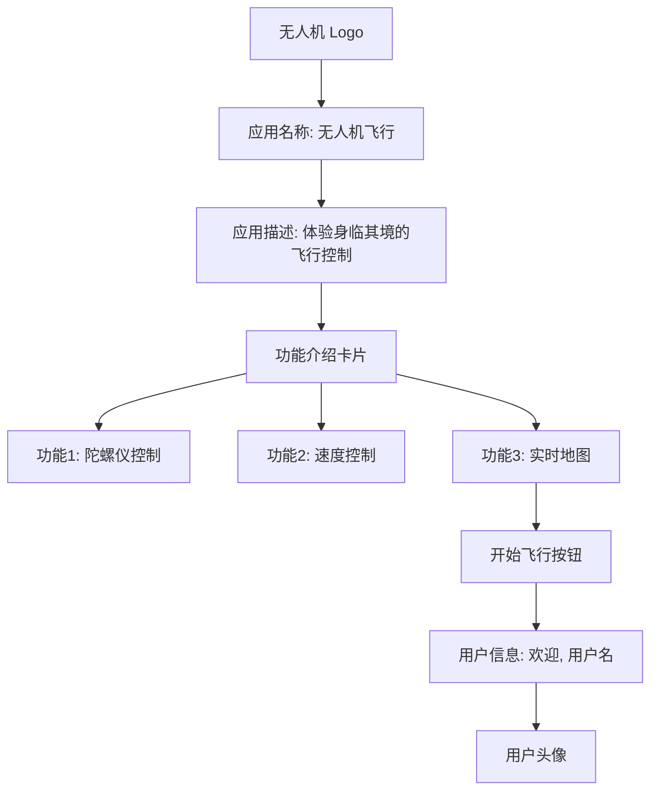
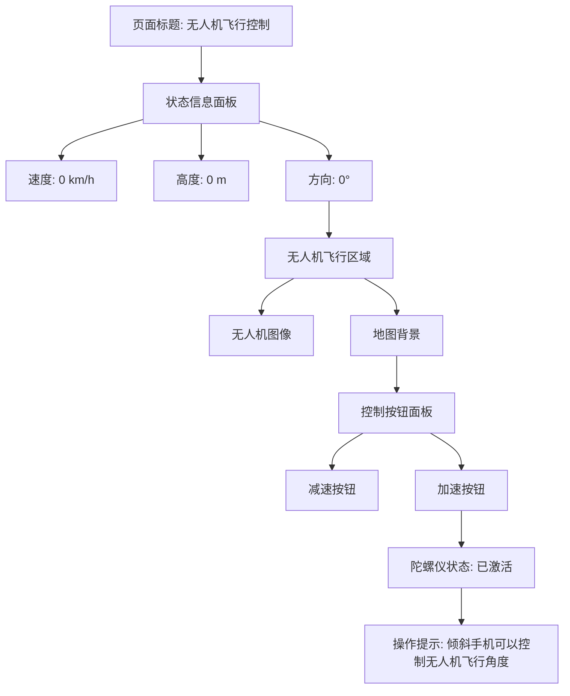
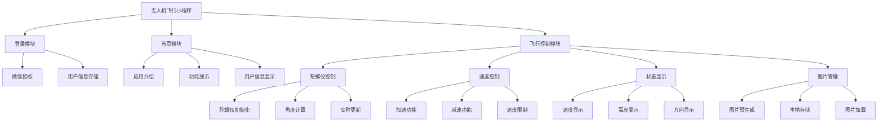
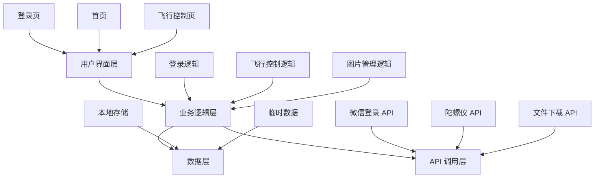

# 无人机飞行微信小程序产品设计图

## 1. 用户流程图



## 2. 页面设计图

### 2.1 登录页



### 2.2 首页



### 2.3 飞行控制页



## 3. 功能模块图

### 3.1 核心功能模块



## 4. 技术架构图



## 5. 界面原型图

### 5.1 登录页原型

```
+------------------------+
|                        |
|        [Logo]          |
|                        |
|    无人机飞行          |
|                        |
|  请登录以开始飞行体验   |
|                        |
|  [微信登录]            |
|                        |
|  登录后可享受完整的     |
|  飞行控制体验           |
|                        |
+------------------------+
```

### 5.2 首页原型

```
+------------------------+
|                        |
|        [Logo]          |
|                        |
|    无人机飞行          |
|                        |
|  体验身临其境的飞行控制  |
|                        |
| +-------------------+  |
| | 陀螺仪控制       |  |
| | 倾斜手机控制飞行角度 |  |
| +-------------------+  |
|                        |
| +-------------------+  |
| | 速度控制         |  |
| | 一键加速/减速     |  |
| +-------------------+  |
|                        |
| +-------------------+  |
| | 实时地图         |  |
| | 真实地图背景      |  |
| +-------------------+  |
|                        |
|  [开始飞行]            |
|                        |
| +-------------------+  |
| | [头像] 欢迎, 用户 |  |
| +-------------------+  |
|                        |
+------------------------+
```

### 5.3 飞行控制页原型

```
+------------------------+
|                        |
|  无人机飞行控制        |
|                        |
| +-------------------+  |
| | 速度: 0 km/h      |  |
| | 高度: 0 m         |  |
| | 方向: 0°          |  |
| +-------------------+  |
|                        |
| +-------------------+  |
| |                   |  |
| |   [无人机图像]     |  |
| |                   |  |
| |   [地图背景]      |  |
| |                   |  |
| +-------------------+  |
|                        |
| +-------------------+  |
| | [减速]   [加速]    |  |
| +-------------------+  |
|                        |
| 陀螺仪状态: 已激活      |
|                        |
| 提示: 倾斜手机可以控制   |
| 无人机飞行角度          |
|                        |
+------------------------+
```

## 6. 图片资源需求

### 6.1 图片类型

| 图片名称 | 用途 | 尺寸 | 格式 |
|---------|------|------|------|
| drone-logo.png | 应用 logo | 200x200 | PNG |
| drone.png | 无人机图像 | 200x200 | PNG |
| map.png | 地图背景 | 800x600 | PNG |
| feature-gyro.png | 陀螺仪功能图标 | 80x80 | PNG |
| feature-speed.png | 速度控制功能图标 | 80x80 | PNG |
| feature-map.png | 地图功能图标 | 80x80 | PNG |
| tab-home.png | 首页标签图标 | 64x64 | PNG |
| tab-home-active.png | 首页标签激活图标 | 64x64 | PNG |
| tab-flight.png | 飞行标签图标 | 64x64 | PNG |
| tab-flight-active.png | 飞行标签激活图标 | 64x64 | PNG |

### 6.2 图片生成提示词 (Prompt)

| 图片名称 | 提示词 |
|---------|--------|
| drone-logo.png | drone logo, minimalist design, blue color scheme, white background, high quality |
| drone.png | drone flying in the sky, realistic, high quality, white background |
| map.png | realistic map view from above, terrain, high quality, blue and green colors |
| feature-gyro.png | gyroscope icon, modern design, blue color scheme, white background |
| feature-speed.png | speed icon, modern design, blue color scheme, white background |
| feature-map.png | map icon, modern design, blue color scheme, white background |
| tab-home.png | home icon, modern design, gray color scheme, white background |
| tab-home-active.png | home icon, modern design, blue color scheme, white background |
| tab-flight.png | flight icon, modern design, gray color scheme, white background |
| tab-flight-active.png | flight icon, modern design, blue color scheme, white background |

## 7. 响应式设计

### 7.1 适配尺寸

| 设备类型 | 屏幕尺寸 | 适配策略 |
|---------|---------|----------|
| 手机 | 375x667 及以下 | 垂直布局，优化触控区域 |
| 平板 | 768x1024 及以上 | 水平布局，增加信息展示 |

### 7.2 响应式调整

- **小屏幕设备**：
  - 简化布局，垂直排列元素
  - 增大按钮尺寸，提升触控体验
  - 减少同时显示的信息数量

- **大屏幕设备**：
  - 水平布局，充分利用屏幕空间
  - 增加详细的飞行数据展示
  - 优化地图显示效果

## 8. 交互设计

### 8.1 触控交互

| 交互类型 | 触发方式 | 反馈效果 |
|---------|---------|----------|
| 按钮点击 | 点击加速/减速按钮 | 按钮颜色变化，速度数值更新 |
| 页面跳转 | 点击开始飞行按钮 | 平滑过渡动画 |
| 微信授权 | 点击微信登录按钮 | 弹出授权对话框 |

### 8.2 陀螺仪交互

| 交互类型 | 触发方式 | 反馈效果 |
|---------|---------|----------|
| 倾斜手机 | 倾斜手机改变角度 | 无人机图像旋转，方向数值更新 |
| 快速倾斜 | 快速改变手机角度 | 无人机图像快速响应，方向数值快速变化 |
| 保持倾斜 | 保持手机倾斜状态 | 无人机图像保持旋转角度，方向数值稳定 |

### 8.3 状态反馈

| 状态类型 | 反馈方式 | 效果 |
|---------|---------|------|
| 加载状态 | 加载提示 | 显示 "加载中..." 文字 |
| 成功状态 | 提示框 | 显示操作成功提示 |
| 错误状态 | 提示框 | 显示错误信息 |
| 陀螺仪状态 | 文字提示 | 显示 "陀螺仪已激活" 或 "陀螺仪激活失败" |

## 9. 视觉层次

### 9.1 登录页

1. **第一层次**：无人机 Logo 和应用名称（视觉焦点）
2. **第二层次**：微信登录按钮（核心操作）
3. **第三层次**：登录提示和说明（辅助信息）

### 9.2 首页

1. **第一层次**：开始飞行按钮（核心操作）
2. **第二层次**：功能介绍卡片（信息重点）
3. **第三层次**：应用 Logo 和名称（品牌识别）
4. **第四层次**：用户信息（个性化信息）

### 9.3 飞行控制页

1. **第一层次**：无人机飞行区域（视觉焦点）
2. **第二层次**：控制按钮面板（核心操作）
3. **第三层次**：状态信息面板（关键信息）
4. **第四层次**：页面标题和操作提示（辅助信息）

## 10. 设计规范

### 10.1 色彩规范

| 颜色名称 | 颜色值 | 用途 |
|---------|-------|------|
| 主色调 | #1890ff | 按钮、标题、强调元素 |
| 加速按钮 | #52c41a | 加速按钮 |
| 减速按钮 | #ff4d4f | 减速按钮 |
| 背景色 | #f5f5f5 | 页面背景 |
| 文本色 | #333333 | 主要文本 |
| 次要文本 | #666666 | 次要文本 |
| 提示文本 | #999999 | 提示文本 |

### 10.2 字体规范

| 字体大小 | 用途 |
|---------|------|
| 36rpx | 页面标题 |
| 32rpx | 按钮文本 |
| 28rpx | 功能标题 |
| 24rpx | 次要文本 |
| 20rpx | 提示文本 |

### 10.3 间距规范

| 间距大小 | 用途 |
|---------|------|
| 40rpx | 大间距（模块间距） |
| 20rpx | 中等间距（元素间距） |
| 10rpx | 小间距（文本间距） |

### 10.4 圆角规范

| 圆角大小 | 用途 |
|---------|------|
| 45rpx | 大按钮 |
| 20rpx | 卡片、容器 |
| 10rpx | 小按钮、输入框 |

## 11. 性能优化设计

### 11.1 加载优化

- **图片预加载**：在开发阶段预先生成图片，避免运行时加载
- **资源压缩**：优化图片大小，减少加载时间
- **按需加载**：只加载当前页面所需的资源

### 11.2 渲染优化

- **减少重绘**：优化 DOM 结构，减少不必要的渲染
- **缓存策略**：缓存已加载的资源，避免重复加载
- **动画优化**：使用 CSS 动画，避免 JavaScript 动画

### 11.3 响应优化

- **防抖处理**：对频繁触发的事件进行防抖处理
- **节流处理**：对高频事件（如陀螺仪变化）进行节流处理
- **异步处理**：将耗时操作改为异步处理，避免阻塞主线程

## 12. 无障碍设计

### 12.1 视觉无障碍

- **颜色对比度**：确保文本与背景的对比度符合无障碍标准
- **字体大小**：提供可调整的字体大小选项
- **视觉提示**：为交互元素提供清晰的视觉反馈

### 12.2 操作无障碍

- **触控区域**：确保按钮等交互元素的触控区域足够大
- **操作反馈**：为所有操作提供明确的反馈
- **容错设计**：允许一定程度的操作误差

### 12.3 信息无障碍

- **文本替代**：为图片提供文本替代说明
- **简洁语言**：使用简洁明了的语言
- **层次清晰**：信息层次清晰，易于理解
