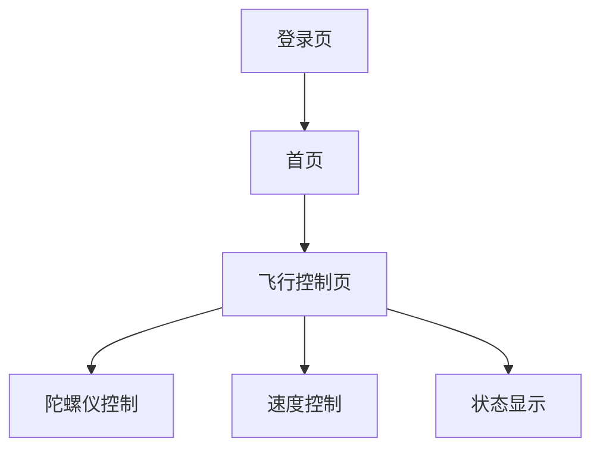

# 无人机飞行微信小程序产品文档

## 1. 产品概述

无人机飞行微信小程序是一款基于微信平台的无人机模拟飞行应用，用户可以通过手机陀螺仪控制无人机飞行角度，通过按钮控制无人机的加速和减速，实现沉浸式的飞行体验。

### 1.1 产品定位

- **目标用户**：无人机爱好者、航空爱好者、科技爱好者
- **产品价值**：提供便捷的无人机飞行模拟体验，无需实际购买无人机即可感受飞行乐趣
- **使用场景**：休闲娱乐、无人机飞行练习、技术体验

### 1.2 核心功能

1. **微信登录**：支持微信用户快速登录
2. **陀螺仪控制**：通过手机陀螺仪感应实现无人机飞行角度控制
3. **速度控制**：通过按钮实现无人机的加速和减速
4. **状态显示**：实时显示无人机的速度、高度和方向
5. **图片管理**：使用预先生成的高质量图片，提升视觉体验

## 2. 产品结构

### 2.1 页面结构

| 页面名称 | 页面路径 | 主要功能 |
|---------|---------|----------|
| 登录页 | `pages/login/login` | 微信登录 |
| 首页 | `pages/index/index` | 应用介绍、功能展示、用户信息 |
| 飞行控制页 | `pages/flight/flight` | 无人机飞行控制、状态显示 |

### 2.2 功能模块

## 3. 界面设计

### 3.1 设计风格

- **主色调**：蓝色 (#1890ff)，代表科技感和天空
- **辅助色**：绿色 (#52c41a) 用于加速按钮，红色 (#ff4d4f) 用于减速按钮
- **字体**：默认微信小程序字体，清晰易读
- **布局**：简洁现代，重点突出飞行控制区域
- **图标**：线性图标，风格统一

### 3.2 页面设计

#### 3.2.1 登录页

- **布局**：居中布局，包含应用 logo、应用名称、登录按钮
- **元素**：
  - 无人机 logo
  - 应用名称 "无人机飞行"
  - 微信登录按钮
  - 登录提示信息
- **交互**：点击登录按钮触发微信授权登录

#### 3.2.2 首页

- **布局**：垂直布局，包含应用介绍、功能展示、用户信息
- **元素**：
  - 应用 logo 和名称
  - 功能介绍卡片（陀螺仪控制、速度控制、实时地图）
  - 开始飞行按钮
  - 用户头像和昵称
- **交互**：点击 "开始飞行" 按钮跳转到飞行控制页

#### 3.2.3 飞行控制页

- **布局**：垂直布局，包含状态信息、飞行控制区域、操作按钮
- **元素**：
  - 速度、高度、方向状态显示
  - 无人机飞行区域（包含无人机图像和地图背景）
  - 加速/减速按钮
  - 陀螺仪状态显示
  - 操作提示
- **交互**：
  - 倾斜手机控制无人机飞行角度
  - 点击按钮控制速度
  - 实时显示飞行状态

## 4. 技术实现

### 4.1 技术栈

- **前端框架**：微信小程序原生框架
- **开发语言**：JavaScript、WXML、WXSS
- **API 调用**：
  - `wx.login()`：微信登录
  - `wx.startGyroscope()`：陀螺仪控制
  - `wx.getStorageSync()`/`wx.setStorageSync()`：本地存储

### 4.2 核心功能实现

#### 4.2.1 微信登录

- 使用 `wx.login()` 获取登录凭证
- 使用 `wx.getUserInfo()` 获取用户信息
- 将用户信息存储到本地，实现自动登录

#### 4.2.2 陀螺仪控制

- 使用 `wx.startGyroscope()` 启动陀螺仪
- 使用 `wx.onGyroscopeChange()` 监听陀螺仪变化
- 根据陀螺仪数据计算无人机飞行角度

#### 4.2.3 速度控制

- 实现 `increaseSpeed()` 和 `decreaseSpeed()` 方法
- 限制速度范围（0-100 km/h）
- 实时更新速度显示

#### 4.2.4 图片管理

- 在开发阶段使用 GPT 生成高质量图片
- 将图片存储到本地文件夹
- 运行时直接使用本地图片，不调用 GPT

### 4.3 性能优化

- **图片优化**：使用适当尺寸的图片，避免过大图片影响加载速度
- **代码优化**：减少不必要的计算和渲染，提高响应速度
- **存储优化**：合理使用本地存储，避免存储过多数据

## 5. 开发流程

### 5.1 开发阶段

1. **环境搭建**：安装微信开发者工具，创建小程序项目
2. **图片生成**：使用 `generate-images.js` 脚本生成所需图片
3. **代码开发**：实现登录、首页、飞行控制等页面
4. **测试**：使用微信开发者工具进行本地测试
5. **部署**：提交代码到 GitHub，发布小程序

### 5.2 图片生成流程

1. 配置 `generate-images.js` 中的 `apiKey` 和 `prompts`
2. 运行 `node generate-images.js` 生成图片
3. 检查 `images` 文件夹中的图片是否生成成功
4. 如有需要，调整 `prompts` 重新生成图片

## 6. 使用指南

### 6.1 首次使用

1. 打开微信小程序
2. 点击 "微信登录" 按钮授权登录
3. 进入首页，查看应用介绍
4. 点击 "开始飞行" 按钮进入飞行控制页
5. 倾斜手机控制无人机飞行角度
6. 点击 "加速" 或 "减速" 按钮控制飞行速度

### 6.2 后续使用

1. 打开微信小程序（自动登录）
2. 直接进入首页或飞行控制页
3. 开始飞行体验

### 6.3 操作技巧

- **平稳控制**：轻微倾斜手机，避免大幅度动作
- **速度控制**：根据场景适当调整速度，新手建议低速飞行
- **观察状态**：注意查看速度、高度和方向信息，保持飞行稳定

## 7. 常见问题

### 7.1 登录问题

- **问题**：无法登录或登录失败
- **解决方法**：检查网络连接，确保微信账号正常，重新尝试登录

### 7.2 陀螺仪问题

- **问题**：陀螺仪无法使用或反应迟钝
- **解决方法**：检查手机陀螺仪是否正常，重启小程序或手机

### 7.3 图片问题

- **问题**：图片显示异常或加载失败
- **解决方法**：检查网络连接，确保图片文件存在，重新生成图片

## 8. 未来规划

### 8.1 功能扩展

- **飞行模式**：增加多种飞行模式（如竞速模式、自由模式、任务模式）
- **场景切换**：增加不同飞行场景（如城市、山区、海边）
- **多人互动**：支持多人同时在线飞行，实现互动体验
- **数据统计**：记录飞行数据，生成飞行报告

### 8.2 技术升级

- **3D 效果**：引入 3D 技术，提升视觉体验
- **AI 辅助**：使用 AI 技术优化飞行控制，提供智能飞行建议
- **云存储**：将飞行数据存储到云端，支持多设备同步

### 8.3 商业价值

- **广告合作**：与无人机品牌、航空机构合作，提供广告展示
- **付费功能**：推出高级飞行模式、场景等付费内容
- **教育应用**：开发无人机飞行教育课程，提供学习资源

## 9. 总结

无人机飞行微信小程序是一款创新的科技应用，通过结合微信平台的便捷性和手机陀螺仪的交互性，为用户提供了沉浸式的无人机飞行体验。产品设计注重用户体验，技术实现稳定可靠，未来发展潜力巨大。

通过不断优化和扩展功能，无人机飞行微信小程序有望成为无人机爱好者的必备工具，同时为更多用户带来科技与娱乐相结合的全新体验。